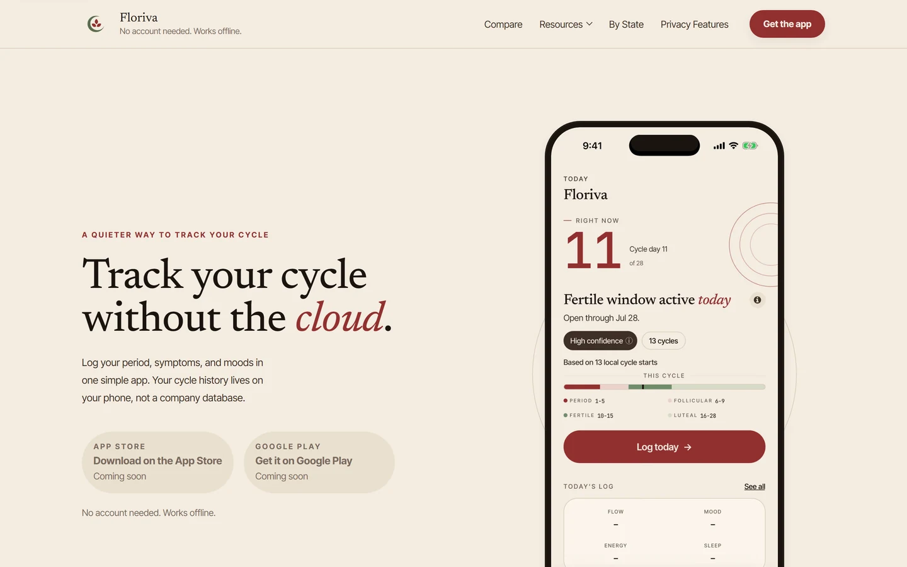
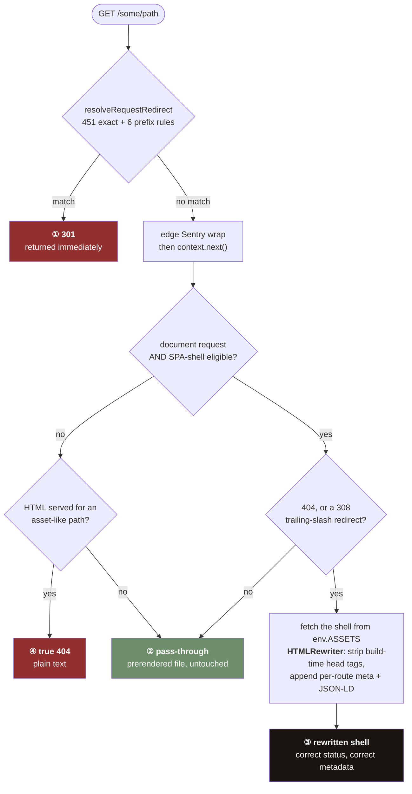
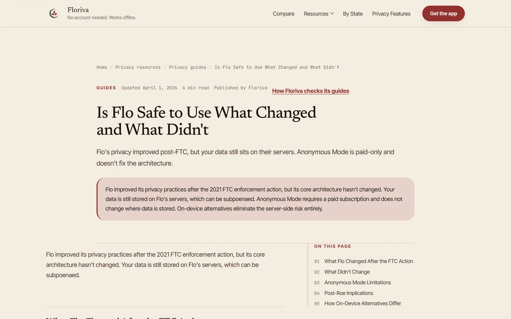
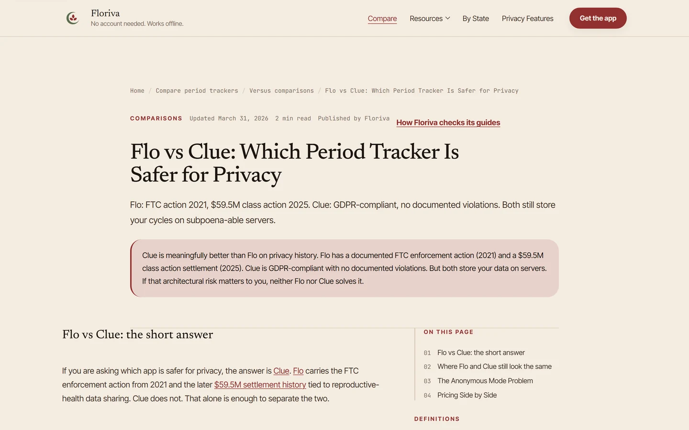
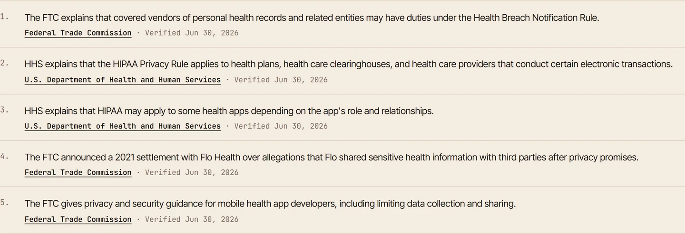
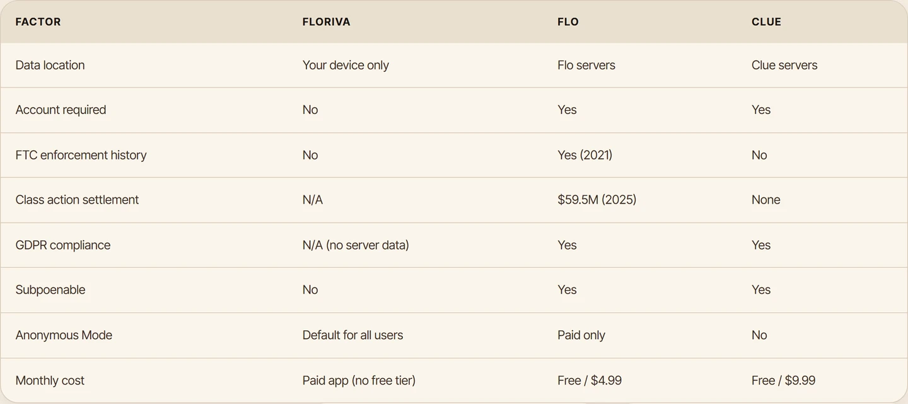
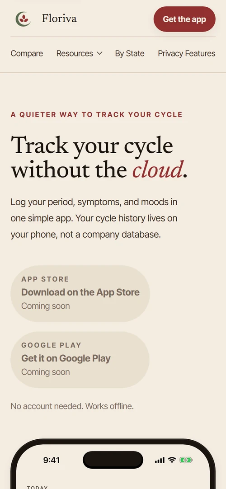
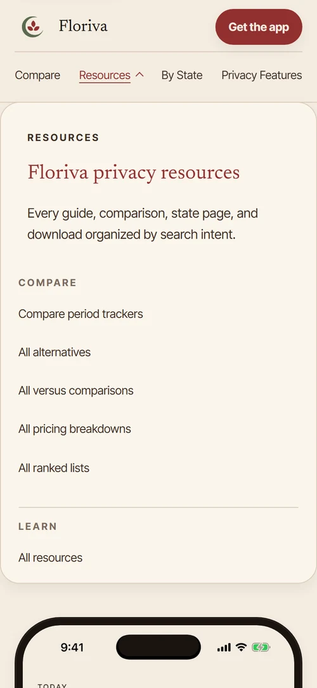
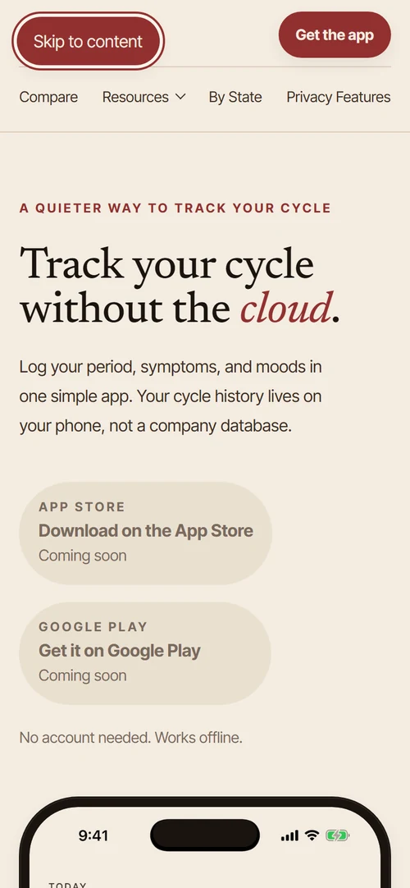

# Floriva Web

The marketing and research site for a local-first period tracker: 470 prerendered
routes, 446 research documents on reproductive-health data privacy, and 41 verification
gates built because there is no meta-framework here to inherit them from.

> [!IMPORTANT]
> **Status: being retired.** The Floriva app was released on the App Store and Google
> Play, and is now being retired. This repository is the site rather than the tracker:
> it was deployed and is complete.

> [!NOTE]
> Built and written by **Angel Campa**
> ([@AngelCampa1](https://github.com/AngelCampa1)). **This repository is a
> single-commit snapshot** of a private working repository, published for review.
> Everything here is complete and builds standalone, but `git log` shows one commit,
> not the 283 that produced it. Figures describing the development history are
> labelled where they appear. License: all rights reserved, published for review and
> not for reuse. See [License](#license) below.




**Home**: the product page, at 1440×900. It deliberately carries no links into the
content corpus; see
[Decision 14](portfolio/DECISIONS.md#14-the-homepage-carries-no-links-into-the-content-corpus).

Both store buttons read "Coming soon" in this capture. That is the fallback state, not
the shipped one: the real listing URLs are in
[`src/site/knowledge/index.ts`](src/site/knowledge/index.ts), and
[`src/site/store-targets.ts`](src/site/store-targets.ts) only enables the links after
`/api/health` reports the store redirects live. The screenshots were taken against
`vite preview`, which serves no Pages Functions, so the probe fails closed. Nothing was
edited to produce that; it is what the code does when the edge is absent.

Floriva was a local-first period tracker. This repository is its marketing and research
site: 446 documents about reproductive-health data privacy, built as prerendered HTML
on Cloudflare. Of those 446, **52 carry the structured `sources:` block** that renders
per-claim citations; the rest do not, and the resulting backlog of 641 uncited
HIGH-severity claims is counted, frozen, and published below rather than rounded down.
The subject matter is why several decisions here look paranoid: no product analytics, no
third-party email transport, query strings scrubbed before they reach Sentry. All of it,
including the three open findings it names (a false data-retention promise, an
unresolved third-party analytics beacon, and a Sentry-scrubbing guarantee that only
holds on one of two surfaces), is consolidated in
[portfolio/SECURITY.md](portfolio/SECURITY.md).

**Looking for the app itself?** It is not here. The tracker is a separate repository:
[`period-tracker-app-floriva-snapshot`](https://github.com/AngelCampa1/period-tracker-app-floriva-snapshot).
This one is the site that markets and researches it.

**What this is:** a real production codebase, deployed, built between April and
August 2026.
**What this is not:** a template, a demo, or a library. It is one site, and the
interesting part is how it is verified rather than how it is built.

---

## Contents

- [If you read one thing](#if-you-read-one-thing)
- [What it did](#what-it-did)
- [Architecture](#architecture)
- [Four things worth reading the code for](#four-things-worth-reading-the-code-for)
- [Eight more, one line each](#eight-more-one-line-each)
- [By the numbers](#by-the-numbers)
- [Testing](#testing)
- [Screenshots](#screenshots)
- [Stack, including the negative space](#stack-including-the-negative-space)
- [Repository map](#repository-map)
- [Documentation](#documentation)
- [Built with AI agents](#built-with-ai-agents)
- [Running it locally](#running-it-locally)
- [Who built this](#who-built-this)
- [License](#license)

---

## If you read one thing

1. **[The gate that couldn't fail, twice →](#2-a-mobile-layout-gate-that-can-fail)**
   `overflow: clip` meant the layout check passed on every page for weeks. The fix was
   a self-test that injects five real defects and demands five errors.
2. **[The pages that rendered and never hydrated →](#1-prerendering-without-a-framework)**
   Correct `<head>`, complete markup, no entry bundle. Green test suite. Now a build gate.
3. **[The test that reads the implementation's source →](#3-a-redirect-verifier-that-reads-the-implementation)**
   457 redirect rules, regex-scraped out of `functions/_middleware.ts` so the check can
   never drift from the thing it checks.
4. **[641 uncited claims, published as a number →](#4-editorial-integrity-as-a-gate)**
   On this subject matter an uncited claim is not a style problem. The backlog is
   counted, frozen, and shipped in the README rather than rounded down.
5. **[What went wrong building this with AI →](portfolio/AI-ASSISTED-DEVELOPMENT.md)**
   Four defects, all the same species: plausible output that passes.
6. **[All 41 gates, and what each one cannot see →](portfolio/TESTING.md)**
   The longer read, and the one document that carries the argument the rest of this
   README makes in summary.

---

## What it did

Floriva's marketing and research site was the public front door for a local-first
period-tracking app: 470 prerendered routes, including the product page and 446
editorial documents on reproductive-health data privacy across 15 content collections,
plus the lead-magnet funnel (35 free downloads and an email nurture sequence capped at
`NURTURE_EMAIL_CAP_PER_LEAD = 7` sends per lead), built to turn readers into app
trials. It ran entirely on Cloudflare: Pages for static delivery, Functions for the
edge layer, D1 for lead storage, R2 for file delivery, and a same-account Worker for
outbound email, with no third-party analytics or advertising SDK anywhere in the stack.

The site shipped and was reachable in production before the underlying app was
retired.

---

## Architecture

Three runtimes in one repository: a build-time Node pipeline, a browser bundle, and two
Cloudflare Workers surfaces.



One request, four terminations, decided by three predicates evaluated at different
depths. The other three diagrams (the content build fan-out, the three
machine-readable surfaces, and the lead-magnet sequence) are in
**[portfolio/ARCHITECTURE.md](portfolio/ARCHITECTURE.md)**.

→ [ARCHITECTURE.md](./portfolio/ARCHITECTURE.md) draws the other three diagrams and
names the module behind each edge

---

## Four things worth reading the code for

### 1. Prerendering without a framework

**Decision.** 470 routes of mostly-static editorial content did not get Next.js or
Astro. `scripts/prerender-html.mjs` reads the already-built `dist/index.html`, swaps
the per-route `<head>` and JSON-LD, replaces `<div id="root">` with markup rendered by
walking an mdast with `unified` + `remark`, and writes one file per route. No React in
the build: `vite build` finishes in 1.96 seconds.

**Consequence.** A `dist/` shipped where content routes had complete markup, a correct
`<head>`, and **no entry bundle**. The pages rendered as static HTML and never became
an app. The test suite was green throughout.

The root cause is the interesting part. A test set `PRERENDER_ROUTES=""`. The script's
truthiness check read empty-string as "unset" and prerendered every route from a
script-less fixture template; the test then restored only `dist/index.html`, leaving
the rest inert while reporting success.

**Mechanism.** [`scripts/verify-prerender-bundle.mjs`](scripts/verify-prerender-bundle.mjs)
now runs as the last step of every build. Every emitted document must carry a
`<script type="module">` whose `src` resolves to a real file in `dist`, and every
sitemap and noindex route must resolve to a document that was actually swept. It walks
all of `dist` rather than globbing `*.html`, because content routes are written
extensionless (`dist/free/<slug>`) and a glob-based check would have inspected almost
nothing and reported success. The exempt-list is `new Set([])`.

The prerenderer also now treats set-but-empty as an error, because no caller can
sensibly mean "prerender nothing."

### 2. A mobile layout gate that can fail

**Decision.** Mobile correctness is checked by a real browser at 390×844 against 21
probe rules and 19 driver rules, tiered against WCAG 2.5.5 (AAA, 44px) and 2.5.8 (AA,
24px plus clearance).

**Consequence.** `.app-shell` is `overflow: clip`. `document.documentElement.scrollWidth`
therefore can essentially never exceed the viewport for in-shell content, so a
horizontal-overflow check built on it passes on everything. Two successive versions of
the gate had this flaw. The second was worse because it was subtler: every overflowing
element resolved to a clipping ancestor and was filed as a non-failing *warning*, so
four injected, genuinely page-breaking defects produced exactly one error between them.
The gate reported PASS, and had been reporting PASS for weeks.

**Mechanism.** [`scripts/verify-mobile-gate-selftest.mjs`](scripts/verify-mobile-gate-selftest.mjs)
loads a real page and injects five synthetic defects one at a time (a 900px block in a
390px viewport, an unwrapped wide table, a `nowrap` CTA row, a `100vw` text block, an
unbreakable 60-character token) and fails if any of them adds zero **errors**. It also
fails if the un-injected baseline is not clean. It imports the gate's own config
object, because hand-building the thresholds twice had already produced a silent
`fixedWarn` / `fixedCoverageWarn` mismatch.

The comment in the source puts it better: *a gate nobody has tried to break is a gate
nobody should trust.*

→ [TESTING.md](./portfolio/TESTING.md) lists all 41 gates and, for each, what it still
cannot see

### 3. A redirect verifier that reads the implementation

**Decision.** 451 exact redirects and 6 prefix redirects live as object literals in
`functions/_middleware.ts`. Consolidating 94 pages into 5 produced chains (A merged
into B, later merged into C), so resolution is a fixed point up to
`MAX_LEGACY_REDIRECT_HOPS = 4`, not a lookup.

**Consequence.** A verifier holding its own copy of 457 rules is a verifier that
eventually disagrees with production and reports success anyway.

**Mechanism.** [`scripts/verify-redirects.mjs`](scripts/verify-redirects.mjs) reads
`functions/_middleware.ts` **as text** and extracts both tables by regex. Importing the
module would be cleaner, but the objects are not exported and the middleware pulls in
Workers globals that do not exist in Node. Then, against a live origin, every rule must
return 301 on both GET and HEAD, with an exactly-matching `Location`, and a request
carrying a query string must arrive with it intact. It separately parses the
human-authored ledger in `docs/seo-400/redirects.md` and asserts parity in both
directions, so the doc and the code check each other.

Regex-scraping source is the ugly option. It is also the one that cannot drift.

### 4. Editorial integrity as a gate

**Decision.** The corpus makes numeric, legal, and dated claims (dollar figures, FTC
actions, case citations, bill numbers) about reproductive-health data law. An uncited
claim here is not a style problem.

**Consequence.** A linter that fails on uncited claims would have to fail 641 times on
day one, so it would be disabled by day two. And it would still not catch the actual
danger, which is a claim quietly changing meaning during an edit.

**Mechanism.** Three layers.
[`scripts/audit-claims.mjs`](scripts/audit-claims.mjs) finds claims with nine regex
patterns and tiers them HIGH / MED / LOW by collection.
[`scripts/freeze-claims-baseline.mjs`](scripts/freeze-claims-baseline.mjs) froze
**1,010 findings across 307 files: 641 HIGH, 98 MED, 271 LOW**, each with an mdast
locator like `body:root.children[14].sentence[1]`, a pattern id, and a SHA-256 of the
source file, all anchored to one commit.
[`scripts/claim-remediation.test.ts`](scripts/claim-remediation.test.ts) re-resolves
every locator on each run, falling back to `git show <sha>:<file>` when the working-tree
file has legitimately moved on.

An edit that shifts an AST index or changes what a cited sentence asserts fails a test.
And the 641 is published rather than rounded down, because a repository claiming zero
uncited claims across 446 documents would be less believable than one that counts them.

The coverage is uneven, and the shape of it is worse than the total. 52 of the 446
documents carry a `sources:` frontmatter array, and they are concentrated where the risk
is lowest: 33 of the 35 lead-magnets, 6 of the 9 `privacy-in-practice` pages. The four
collections `audit-claims.mjs` itself tiers HIGH (`reproductive-privacy-state-pages`,
`comparisons`, `guides`, `alternatives`) carry structured citations on **4 of their 181
files**, and `comparisons` and `alternatives` carry none at all. Seven collections have
no `sources:` field anywhere: `alternatives`, `comparisons`, `listicles`, `app-guides`,
`hormone-guides`, `wellness-guides`, `pricing-breakdowns`. All 641 HIGH findings sit in
those four collections by construction, because that is how `audit-claims.mjs` tiers.
The gate counts the debt; it has not paid it.

[`scripts/verify-sources.mjs`](scripts/verify-sources.mjs) is the fourth layer and the
humblest: it fetches every source URL and classifies PASS / PAYWALLED / MISSING /
DRIFT / ERROR / TIMEOUT. It is a reachability gate, not a fact-checker, and the source
says so.

→ [DECISIONS.md](./portfolio/DECISIONS.md) records why the linter counts the backlog
instead of failing on it · the frozen baseline itself is in `docs/seo-400/`

---

## Eight more, one line each

| | |
|---|---|
| **Zod at the content boundary** | 446 MDX files → validated TypeScript. Malformed frontmatter fails the build instead of rendering a broken page. [`build-content-data.mjs`](scripts/build-content-data.mjs) |
| **[`index-policy.json`](src/site/index-policy.json) drives two pipelines in opposite directions** | 26 routes subtracted from the sitemap and added back to the prerender list: live and linked for readers, withdrawn from search. |
| **The email Worker is unreachable from the internet** | `workers_dev = false`, so `/internal/send` exists only behind a service binding, with a constant-time secret compare on top. |
| **Neutral 202s everywhere** | Honeypot hit, unsubscribed lead, duplicate claim: the browser cannot tell any of them from success. |
| **A per-lead nurture cap across all resources** | `NURTURE_EMAIL_CAP_PER_LEAD = 7`, enforced at send time, so five downloads don't mean thirty-five emails. |
| **Sentry scrubs the URL, not just the body** | On this property a query string can carry a state name or a condition slug. |
| **Static nav emitted into prerendered HTML** | A crawled page was exposing ~9 internal links against ~38 in the rendered DOM. |
| **Self-hosted fonts, licences shipped with them** | Three OFL-1.1 families under `public/fonts/licenses/`, and the all-rights-reserved `LICENSE` carves them out explicitly. |

---

## By the numbers

Generated by [`scripts/portfolio-metrics.mjs`](scripts/portfolio-metrics.mjs) from
`git ls-files`: nothing gitignored can be counted, and generated code is never
counted as authored work. Measured on 2026-08-07 from a clean working tree; full
breakdown and the exact revision: **[portfolio/METRICS.md](portfolio/METRICS.md)**.

Regenerate with `pnpm metrics`. It reproduces every figure in the tables below exactly,
with one known exception, in a table that is not reproduced here:
`portfolio/METRICS.md`'s prose-documentation row drifts in file count as well as line
count whenever portfolio docs are added or edited after a measurement. A direct
recount against that file's own classifier found 50 files and 18,976 lines, against the
45 and 17,987 the 2026-08-07 measurement reported. Five files were added afterward,
three of them in the most recent portfolio-standard pass. Full account:
[portfolio/METRICS.md](portfolio/METRICS.md). This is an artefact of this snapshot
rather than of the code. The commit row correctly reports `1, squashed snapshot`,
matching this repository's own `git log`. The 283-commit history lives in the private
working repository. Commit counts are the one class of figure here you cannot verify
locally, and they are marked wherever they appear.

### Authored

| | Files | Lines |
|---|---:|---:|
| Application source (`src/`, `functions/`, `worker/`) | 75 | 12,185 |
| Tests | 63 | 9,659 |
| Build and verification tooling (`scripts/`) | 53 | 16,444 |
| Styles | 15 | 3,565 |
| SQL migrations | 15 | 231 |
| **Total** | **221** | **42,084** |

### Generated and content, not authored directly

Reported separately because counting it as authored work would be a lie.

| | Files | Lines |
|---|---:|---:|
| Content documents (`content/**/*.mdx`) | 446 | 61,599 |
| Generated modules (`pnpm generate:content`) | 458 | 141,323 |

### Surface and proof

| | |
|---|---:|
| Prerendered routes (444 indexed + 26 `noindex, follow`) | 470 |
| Tests, from a real run on 2026-08-07 (0 failing, 2 skipped) | 431 |
| Line coverage across 71 application files | 90.2% |
| Branch coverage | 80.7% |
| Verification gates, of 66 npm scripts | 41 |
| Redirect rules verified against a live origin | 457 |
| Editorial claims frozen to mdast locators | 1,010 |
| D1 tables across 15 migrations | 12 |
| Commits since 2026-04-21 (private repo, not verifiable here) | 283 |

Raw output for every one of these: **[docs/evidence/](docs/evidence/)**.

---

## Testing

431 tests (0 failing, 2 skipped, from the 2026-08-07 run this README cites) across
Vitest + jsdom for unit and integration coverage, Playwright for the browser-driven
gates (the mobile layout gate among them) and `node:test` for one script suite. Line
coverage sits at 90.2% across 71 application files; branch coverage at 80.7%.

Coverage numbers alone undercount what actually gets checked here: 41 of 66 npm
scripts are verification gates, not build steps: a redirect verifier that
regex-scrapes its own implementation instead of duplicating it, a mobile-layout
self-test that injects five synthetic defects and demands five errors, and a
claims-baseline test that re-resolves 1,010 frozen mdast locators on every run. All 41
are enumerated, with what each one still cannot see, in
**[portfolio/TESTING.md](portfolio/TESTING.md)**.

There is no CI. Every gate above runs locally, by hand, before deploy. Every claim
here is true as of one run rather than continuously true.

---

## Screenshots

Desktop at 1440×900. Light theme only: there is no dark theme, and faking one for a
screenshot would misrepresent the product.

| | |
|---|---|
|  |  |
| **Resources**: the entry point to 446 documents across 15 collections. | **Free downloads**: the lead-magnet hub, 35 pages. This is the funnel the email Worker and its `NURTURE_EMAIL_CAP_PER_LEAD = 7` exist for. |
|  |  |
| **A guide**: sticky table of contents, breadcrumbs, per-article verification link. | **A comparison**: the answer is stated before the argument, including when the answer is a competitor. |

**Per-claim citation with a verification date**, on the 52 documents that carry a
`sources:` block. This is what the editorial gate is protecting:



**A comparison table that names the product's own weaknesses**: "Paid app (no free
tier)", "N/A (no server data)":



### Mobile

These are not marketing renders. They are the exact frames the layout gate assessed in
the run captured in [docs/evidence/](docs/evidence/): 390×844 @2x, reduced motion,
Turnstile stubbed at its real footprint.

| Loaded | Megamenu | Modal | Skip-link focus |
|---|---|---|---|
|  |  |  |  |

The fourth one is the interesting one. The skip link is offscreen until focused, which
means it is invisible to every screenshot-based check and to most humans reviewing a
build. It is audited in its own capture state, with its own rules:
`skip-link-not-first`, `skip-link-too-small`, `skip-link-offscreen`.

---

## Stack, including the negative space

| | |
|---|---|
| **UI** | React 19.2, react-router 7.14, TypeScript 6.0 |
| **Build** | Vite 8.0; `unified` + `remark` for the prerenderer |
| **Validation** | Zod 4 at the content boundary |
| **Test** | Vitest 3.2 + jsdom, Playwright 1.61 for browser gates, `node:test` for one script suite |
| **Edge** | Cloudflare Pages Functions, Workers, D1, R2, Email, Turnstile |
| **Observability** | Sentry on client and edge. No product analytics. |

Nine runtime dependencies. Twenty-eight dev dependencies. What is deliberately absent:

- **No meta-framework.** 470 static routes did not need one, and the four gates above
  are the bill for that.
- **No CSS framework.** 15 stylesheets, 3,565 lines. The token layer mirrors the mobile
  app's `theme/tokens.ts` and must stay diffable against it by eye.
- **No component library.** 23 component and page files. A dependency with an opinion
  about button geometry would have fought the design canon.
- **No product analytics.** PostHog was removed; `/ph/*` returns 404 with
  `POSTHOG_ENDPOINT_RETIRED`, so a stale client fails loudly rather than believing it is
  being recorded.

Reasoning for each: **[portfolio/DECISIONS.md](portfolio/DECISIONS.md)**, fourteen decisions,
five fields each.

---

## Repository map

```text
src/            React 19 SPA, 23 component and page files, plus the content loader
content/        446 MDX documents across 15 collections
scripts/        The build pipeline and all 41 verification gates
functions/      Cloudflare Pages Functions: redirects, health, store, edge Sentry
worker/         The email Worker. workers_dev = false, service binding only
migrations/     15 D1 migrations, 12 tables
portfolio/      The write-ups linked below
docs/           Working notes: research corpus, SEO ledgers, plans, raw run output
```

## Documentation

**[portfolio/](./portfolio/README.md)** is the finished, evidence-backed write-up:
[security and privacy architecture](./portfolio/SECURITY.md), architecture, decisions,
testing, metrics, the AI-assisted-development method, and a dated engineering log,
each traceable to a file or a command. **[docs/](./docs/)** is the opposite:
prospective, dated working notes: the SEO-400 rollout ledger, QA reports, research
corpus, and the raw run output every number above is measured from.

---

## Built with AI agents

In the private working repository, 148 of the 283 commits carry a Claude co-author
trailer. Squashing this snapshot removed them, so that figure is one you take on trust
rather than verify here. It is stated as a method rather than a disclaimer, and the
subject of **[portfolio/AI-ASSISTED-DEVELOPMENT.md](portfolio/AI-ASSISTED-DEVELOPMENT.md)** is
what had to be built because agents were used.

Agents are fast at producing code and fast at producing *the appearance of
verification*. Those two capabilities are not equally trustworthy, and the gap between
them is where all four defects above lived. The response was not more tests. It was
gates that are harder to satisfy falsely: a verifier that reads the implementation
rather than a copy of it, a layout check with a self-test, a claims baseline that fails
on silent change, and a build that fails unless all 470 documents carry a resolvable
entry bundle.

[`CLAUDE.md`](CLAUDE.md) and [`AGENTS.md`](AGENTS.md) are checked in and reviewed like
source, because they encode the constraints that are expensive to rediscover.

→ [AI-ASSISTED-DEVELOPMENT.md](./portfolio/AI-ASSISTED-DEVELOPMENT.md) walks each of the
four defects and the gate that now catches it

---

## Running it locally

Node `>=22.17.1 <23`, pnpm 10.33.

```bash
pnpm install --frozen-lockfile
pnpm dev
```

`predev` regenerates the content modules first, so a fresh clone works without a
separate step.

```bash
pnpm typecheck && pnpm lint
pnpm test:coverage
pnpm build
```

`pnpm build` ends by prerendering 470 routes and refusing to finish if any of them is
missing its entry bundle. Then, with `pnpm preview` running on 4173:

```bash
pnpm verify:mobile-gate-selftest && pnpm verify:mobile-layout:fast
```

Re-measure everything in this README:

```bash
pnpm metrics
```

The edge layer needs `wrangler pages dev` rather than Vite preview:
`pnpm preview:pages` on 8788. `vite preview` SPA-fallbacks extensionless paths to 200,
so it cannot be used to verify redirects or 404 behaviour.

Environment variables: [`.env.example`](.env.example), names only.

---

## Who built this

Built and written by **Angel Campa**
([@AngelCampa1](https://github.com/AngelCampa1)), solo, with AI agents doing a large
share of the implementation under the constraints recorded in
[`CLAUDE.md`](CLAUDE.md) and [`AGENTS.md`](AGENTS.md). See
[Built with AI agents](#built-with-ai-agents) above for what that meant in practice and
what it got wrong. Development happened in a private working repository between April
and August 2026; this repository is the public, single-commit snapshot of it.

---

## License

All rights reserved. See [LICENSE](LICENSE). This code is published for review, not
for reuse.

The three self-hosted font families are SIL Open Font License 1.1 and are explicitly
carved out; their licences ship alongside the `.woff2` files in
[`public/fonts/licenses/`](public/fonts/licenses/). Third-party notices:
[THIRD-PARTY-LICENSES.md](THIRD-PARTY-LICENSES.md).
