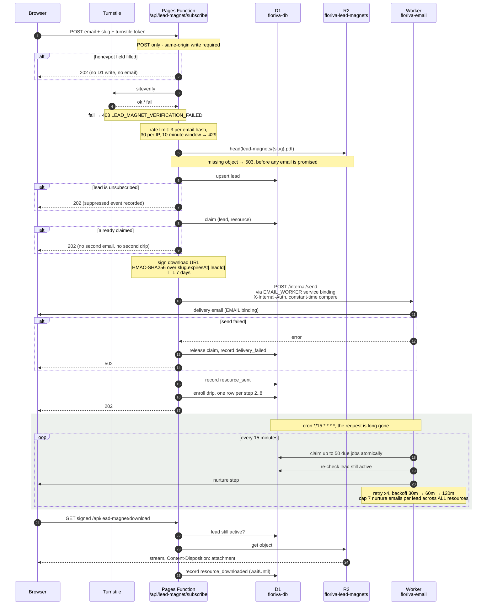

# Resource Delivery

Floriva's resource request flow uses Cloudflare R2 as the canonical source for
PDF resources, Cloudflare Pages Functions for capture and signed downloads, D1
for request and delivery state, and the dedicated `floriva-email` Worker for all
outbound email. The Worker owns the Cloudflare Email Service `EMAIL` send binding
(a Workers-only feature) and a cron trigger that runs the follow-up nurture drip.
Pages Functions never send email directly; they reach the Worker over a service
binding for the immediate delivery email.

## Sequence

Six participants and two clocks. The immediate path is synchronous; the drip runs on
a cron the request never waits for. Every early return below is a *neutral* `202`:
the browser cannot tell a honeypot hit, an unsubscribed lead, or a duplicate claim
apart from a real success, which is the point.



**Why the R2 `head` happens before the D1 write.** Checking the object exists after
sending the email would produce a lead who was promised a file that is not there.
Checking it before means the failure is a 503 the visitor can retry, not a broken link
in their inbox.

**Why the claim is released on send failure.** The `(lead, resource)` claim is what
makes duplicate submissions neutral. If a send fails and the claim were kept, the
visitor's retry would be treated as a duplicate and silently do nothing: they would
never get the file and the form would keep saying it worked.

## floriva-email Worker

`worker/` is a separate deployable (`worker/wrangler.toml`, service name
`floriva-email`). It has two entry points in `worker/src/index.ts`:

- `fetch()` exposes `POST /internal/send`, authorized by the `X-Internal-Auth`
  header carrying the shared `INTERNAL_SEND_SECRET` value, which sends one built
  message via the `EMAIL` binding. This is the immediate delivery path invoked by
  Pages. The Worker sets `workers_dev = false`, so this route is reachable only
  over the Pages service binding, not the public internet.
- `scheduled()` runs every 15 minutes and sweeps due `lead_magnet_sequence_jobs`
  rows, sending nurture steps 2-8 through the same `EMAIL` binding.

Sending to real subscribers requires `floriva.app` enabled for Cloudflare Email
Service (Email Sending) with DKIM/SPF verified in the dashboard. The legacy Email
Routing send binding only mails pre-verified addresses and is not sufficient.

## Marketing Data Store

Cloudflare D1 database `floriva-db` is the canonical store for Floriva marketing
data. This includes waitlist signups, referrals, survey responses, pricing
clicks, feedback, resource downloads, resource requests, and resource events.

This standalone marketing site should not depend on Neon/Postgres for marketing
state. If a future product backend uses Neon, keep that boundary separate and do
not reintroduce marketing tables into the primary product database.

## Required Cloudflare Bindings

Pages Functions use the bindings in `wrangler.toml`:

- `LEAD_MAGNET_BUCKET`: R2 bucket binding for `floriva-lead-magnets`
- `LEAD_MAGNET_DB`: D1 database binding
- `LEAD_MAGNET_DOWNLOAD_SIGNING_SECRET`: secret used to sign expiring download links
- `EMAIL_WORKER`: service binding to the `floriva-email` Worker. This is a config-as-code Pages project, so the `[[services]]` entry in `wrangler.toml` is the production binding and is applied by `wrangler pages deploy` (the dashboard binding view is read-only); the same entry also resolves the binding under `wrangler pages dev`
- `INTERNAL_SEND_SECRET`: shared secret authorizing Pages -> Worker send calls (set on both the Pages project and the Worker)
- `SENTRY_DSN`: secret, when edge Sentry is enabled
- `SENTRY_ENVIRONMENT`: edge environment label
- `SENTRY_RELEASE`: optional release identifier
- `TURNSTILE_SECRET_KEY`: Cloudflare Turnstile secret, set in the Cloudflare Pages project
- `VITE_TURNSTILE_SITE_KEY`: public Cloudflare Turnstile site key available during the Vite build

The `floriva-email` Worker (`worker/wrangler.toml`) uses:

- `EMAIL`: Cloudflare Email Service send binding
- `LEAD_MAGNET_DB`: the same `floriva-db` D1 database
- `INTERNAL_SEND_SECRET`: secret matching the Pages value
- `EMAIL_FROM` / `EMAIL_REPLY_TO` / `SITE_ORIGIN`: sender identity and link origin (vars)

The Turnstile widget must allow `floriva.app` and the active Pages preview
hostname used for QA. If the browser console shows Cloudflare Turnstile error
`110200`, the public site key is not valid for the current hostname; update the
widget's allowed hostnames or replace both the Pages secret and Vite site key
with a Floriva-specific widget.

Apply D1 migrations before enabling the flow in production:

```bash
pnpm migrate:remote
```

The migration directory includes legacy D1 marketing migrations already recorded
in production. Follow-up nurture state lives in the `lead_magnet_sequence_jobs`
table (revived by `0011_revive_lead_magnet_sequence_jobs.sql`), which the
`floriva-email` Worker reads and writes.

## R2 Resources

Each configured resource in `src/site/lead-magnets.ts` must have a matching
private R2 object at:

```text
floriva-lead-magnets/lead-magnets/<slug>.pdf
```

Upload or replace a PDF with:

```bash
pnpm exec wrangler r2 object put floriva-lead-magnets/lead-magnets/privacy-guide.pdf \
  --remote \
  --file drafts/lead-magnet-pdfs/privacy-guide.pdf \
  --content-type application/pdf
```

Verify every configured resource exists in R2 and is a non-trivial PDF:

```bash
pnpm verify:lead-magnets
```

Run local Functions and middleware checks against Cloudflare Pages preview, not
Vite preview:

```bash
pnpm build
pnpm preview:pages
pnpm verify:lead-magnet:prod-smoke -- --origin http://localhost:8788
pnpm verify:redirects:local
```

Run a production public smoke check after deploy:

```bash
pnpm verify:lead-magnet:prod-smoke
```

This check needs no secrets. It verifies the public resource page, health endpoint, old static download rejection, unsigned signed-download rejection, missing unsubscribe-token rejection, cross-origin subscribe rejection, and browser rendering of the inline form.

For full signed-link proof, first submit the production form with `FLORIVA_PROD_TEST_EMAIL` and copy the delivery email links into ignored environment variables:

```bash
$env:LEAD_MAGNET_E2E_DOWNLOAD_URL = "https://floriva.app/api/lead-magnet/download?..."
$env:LEAD_MAGNET_E2E_UNSUBSCRIBE_URL = "https://floriva.app/api/lead-magnet/unsubscribe?t=..."
pnpm verify:lead-magnet:prod-full
```

The full check downloads the PDF, opens the unsubscribe confirmation, posts the unsubscribe form, and confirms the same download link is rejected afterward. It mutates the test lead, so use only a QA address.

Fully automated inbox proof needs a test inbox reader or provider API credential. Without that, the repo can prove the public flow and any supplied signed links, but it cannot fetch the delivery email by itself.

Draft PDF generation writes to `drafts/lead-magnet-pdfs/`, which is ignored by
git and not deployed. Do not put resource PDFs under `public/`; production
delivery should use R2-backed signed URLs only.

## Signed Download Flow

After a visitor submits the form, `/api/lead-magnet/subscribe` builds the
delivery email and hands it to the `floriva-email` Worker (over the `EMAIL_WORKER`
service binding) to send. The email carries a signed URL for
`/api/lead-magnet/download`. The download endpoint verifies the slug, expiry,
and HMAC signature, then streams the private R2 object with an attachment
filename.

Download links expire after seven days. Immediately after the delivery email
succeeds, the subscribe endpoint enrolls the lead in the in-app nurture drip by
writing one `lead_magnet_sequence_jobs` row per follow-up step (2-8).

The subscribe endpoint is hardened against public-form abuse:

- hidden honeypot submissions return neutral success without touching D1 or email
- Cloudflare Turnstile is verified before any storage or delivery side effect
- repeated submissions for the same email identity are throttled
- each lead/resource pair is claimed once, and duplicate claims return neutral success without another delivery email or drip enrollment

## Scheduled Resource Emails

Enrollment materializes all follow-up steps at signup with fixed due dates
(offsets of 1/3/6/10/15/20/25 days, sent at ~15:00 UTC). The `floriva-email`
Worker's cron `scheduled()` handler sweeps due jobs every 15 minutes: it
atomically claims each row (so overlapping runs never double-send), re-checks the
lead is still active, sends the step, and marks it sent. Transient failures retry
with exponential backoff up to four attempts. Unsubscribing updates local lead
status and cancels every outstanding nurture job for that lead.

Enrollment is per `(lead, resource)`, so a lead who requests several magnets is
enrolled in several drips. A global per-lead cap (`NURTURE_EMAIL_CAP_PER_LEAD` in
`src/site/knowledge/lead-magnet-email-data.ts`, default one full sequence) bounds
the total nurture email any single lead receives across all resources. The sweep
enforces it at send time: because due jobs are processed in `due_at` order, the
earliest-due steps are sent and any step beyond the cap is cancelled (recorded as
a `sequence_cancelled` event with reason `lead_cap_reached`). The cap counts
delivered and in-flight steps, so overlapping sweeps respect the same ceiling. The
immediate day-0 delivery email is transactional and does not count toward the cap.

## Deployment

Deploy Pages:

```bash
pnpm run deploy
```

The root deploy command applies remote D1 migrations, verifies R2 resources,
verifies Cloudflare Pages and Worker configuration, deploys the `floriva-email`
Worker, then deploys Pages. The Worker is deployed before Pages so the service
binding target exists.

Deploy the Worker on its own with:

```bash
pnpm run deploy:worker
```
