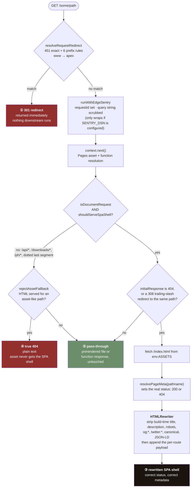
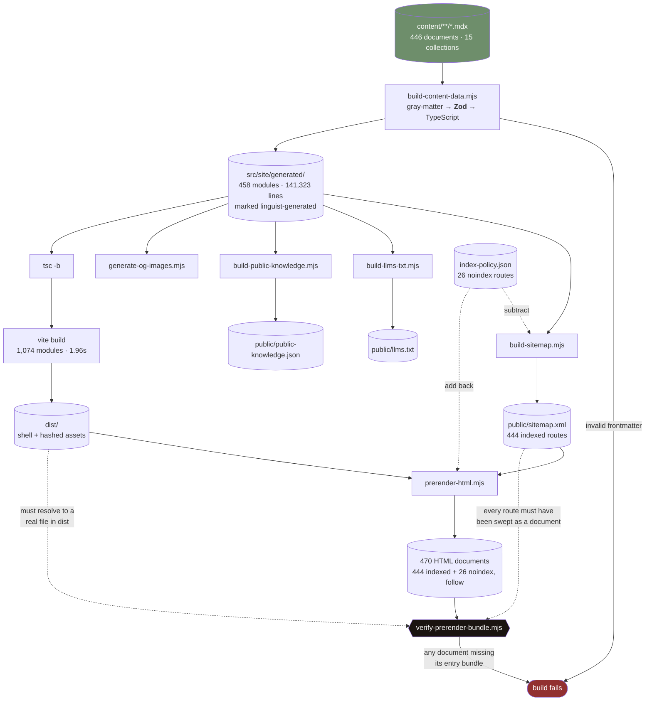
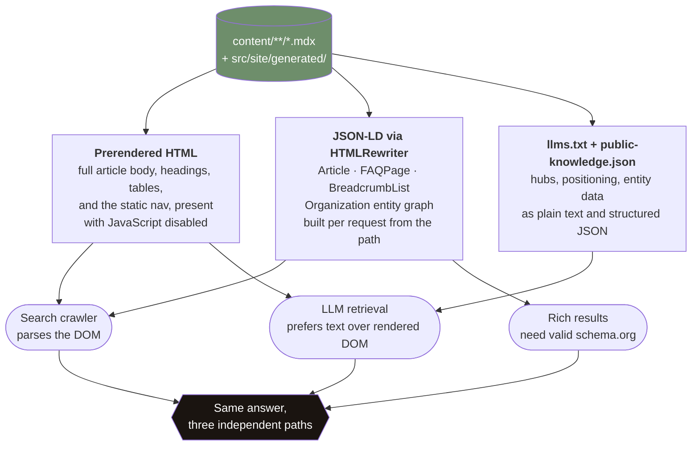

# Architecture

Four diagrams and the reasoning behind them. Each one is here because the thing it
shows is *not* a sequence: prose would force it into a false order and lose the
point.

- [1. Request lifecycle](#1-request-lifecycle): one request, four ways to end
- [2. Content build pipeline](#2-content-build-pipeline): a fan-out with gates at different stages
- [3. Three machine-readable surfaces](#3-three-machine-readable-surfaces): a star, not a path
- [4. Lead-magnet delivery](../docs/lead-magnet-delivery.md#sequence): lives with the runbook it belongs to

---

## The shape of the thing

```text
content/**/*.mdx  ──build──▶  src/site/generated/  ──▶  React app  ──▶  dist/
      446 docs                  Zod-validated TS         Vite            470 routes
                                                                          │
                                                    ┌─────────────────────┘
                                                    ▼
                             Cloudflare Pages  ◀──  functions/  (9 handlers, 11 shared modules)
                                                    │
                                                    ├── D1  floriva-db        12 tables
                                                    ├── R2  floriva-lead-magnets
                                                    └── service binding ──▶  floriva-email Worker
                                                                              EMAIL binding + */15 cron
```

Three runtimes, one repository: a build-time Node pipeline, a browser bundle, and two
Cloudflare Workers surfaces (Pages Functions, and a standalone Worker). They share
types through `src/site/`, which is why the generated content tree is committed.

---

## 1. Request lifecycle

A document request has **four distinct terminations**, and which one it takes is
decided by three separate predicates evaluated at different depths. Written as prose
this reads as a pipeline with one exit. It is not.



**Why HTMLRewriter runs at the edge and not at build time.** Terminations ② and ③
serve different artifacts. ② is a real prerendered file with a real `<head>` already
baked in by `scripts/prerender-html.mjs`. ③ is the single SPA shell standing in for a
route that has no file (a client-routed path, or a path that should 404). The shell is
one document serving many URLs, so its metadata cannot exist until the URL is known.
`resolvePageMeta(pathname)` computes it per request, and HTMLRewriter strips the
shell's placeholder tags before appending the real ones. Stripping first is the part
that matters: appending alone would leave two `<title>` elements and two canonicals.

**Why ④ exists separately from ②.** Pages will happily serve `index.html` for a
missing `.js` or `.png`, producing a 200 with an HTML body where a script was
expected. `rejectAssetFallback` converts that into a genuine 404 in plain text, so a
missing asset fails as a missing asset rather than as a silent parse error in the
browser.

**Redirect resolution is a fixed point, not a lookup.** `resolveLegacyRedirectPathOnce`
is applied repeatedly up to `MAX_LEGACY_REDIRECT_HOPS = 4`, because consolidation
produced chains: page A merged into B, which later merged into C. Resolving once
would have shipped a 301 to a 301.

---

## 2. Content build pipeline

The build is a fan-out from one source of truth to six artifacts, with **gates
attached at different stages**: some before the fan-out, some after, and one at the
very end that validates the output of a step three stages upstream. That last edge is
the reason this is a diagram.



**Read the dotted edges.** `index-policy.json` is *subtracted* from the sitemap and
*added back* to the prerender route list. Those 26 `/free/` routes are withdrawn from
search but stay live and linked for readers, so they must be built and must not be
listed. One file drives both halves, in opposite directions, which is exactly the
kind of thing a prose description gets wrong.

**The verifier reaches backwards.** `verify-prerender-bundle.mjs` runs last but
validates `vite build`'s output through the prerenderer: every emitted document must
carry a `<script type="module">` whose `src` resolves to a file that actually exists in
`dist`. It also walks all of `dist` rather than globbing `*.html`, because content
routes are written **extensionless**: `dist/free/<slug>`, not `dist/free/<slug>.html`.
A glob-based check would have inspected almost nothing and reported success.

The exempt-list is `new Set([])` and stays that way.

---

## 3. Three machine-readable surfaces

Prose lists these one after another and implies a hierarchy. There isn't one. Three
independent consumers each read a different artifact, and the artifacts are generated
from the same corpus so they cannot disagree. The claim is convergence, and
convergence is a star.



**Why three and not one.** A crawler that executes JavaScript reads the hydrated DOM.
A crawler that does not reads the prerendered HTML, which is why the primary nav is
emitted statically, after a crawled content page was observed exposing about nine
internal links against roughly thirty-eight in the rendered DOM. An LLM retrieval
pipeline typically takes the text and ignores both. Serving one surface well and
letting the others degrade means one of the three consumers gets a worse answer, and
you do not get to choose which.

**Why JSON-LD is built at the edge.** Same reason as termination ③ above: it is
derived from the pathname. The prerenderer emits its own copy for the static case, and
`scripts/prerender-html.mjs` carries a comment requiring it to mirror
`src/site/structured-data.ts`, a duplication that is acknowledged in the source rather
than hidden.

---

## Edge layer

Nine route handlers and eleven shared modules under `functions/`, every one with a
colocated test.

| Surface | Purpose |
|---|---|
| `functions/_middleware.ts` | Redirects, SPA-shell resolution, HTMLRewriter SEO injection, asset-fallback rejection |
| `functions/[[path]].ts` | Catch-all that routes every path into the middleware handler |
| `functions/api/health.ts` | Health endpoint, exposes store-redirect readiness |
| `functions/api/lead-magnet/*` | `subscribe`, `download`, `unsubscribe` |
| `functions/_lib/*` | Bindings, HTTP helpers, Turnstile, Sentry, store targets, and six lead-magnet modules |

Bindings: `LEAD_MAGNET_DB` (D1 `floriva-db`), `LEAD_MAGNET_BUCKET` (R2
`floriva-lead-magnets`), `EMAIL_WORKER` (service binding to the `floriva-email`
Worker). No KV.

**Sentry is optional by construction.** `runWithEdgeSentry` wraps the request in
`@cloudflare/pages-plugin-sentry` only when `SENTRY_DSN` is present; otherwise it calls
`context.next()` directly. A missing DSN is a configuration state, not an error path.
When it is active, `beforeSend` scrubs the query string and the search params off
`request.url`. On this property a URL can carry a state name or a condition slug.

---

## The email Worker

`floriva-email` is a separate deployable, not a Pages Function, for one reason:
`workers_dev = false`. Its `/internal/send` endpoint is reachable **only** through the
service binding, never from the public internet, and the shared secret is compared in
constant time on top of that.

It has two entry points:

- `fetch`: `POST /internal/send`, called synchronously by the subscribe endpoint.
- `scheduled`: cron `*/15 * * * *`, sweeping `lead_magnet_sequence_jobs` in D1.

The sweep takes `BATCH_LIMIT = 50` jobs, retries up to `MAX_ATTEMPTS = 4` with
exponential backoff (30m → 60m → 120m), and enforces
`NURTURE_EMAIL_CAP_PER_LEAD = 7` as a ceiling across *all* resources a lead has
requested, not per resource. That distinction is the one that keeps a curious reader
who downloads five worksheets from receiving thirty-five emails.

Full flow, bindings, signing, and abuse controls:
**[docs/lead-magnet-delivery.md](../docs/lead-magnet-delivery.md)**.

---

## Stack, including the negative space

| | |
|---|---|
| **UI** | React 19.2, react-router 7.14, TypeScript 6.0 |
| **Build** | Vite 8.0, `unified` + `remark` for the prerenderer |
| **Validation** | Zod 4 at the content boundary |
| **Test** | Vitest 3.2 + jsdom, Playwright 1.61 for browser gates, `node:test` for three script suites |
| **Edge** | Cloudflare Pages Functions, Workers, D1, R2, Email routing, Turnstile |
| **Observability** | Sentry on client and edge. No product analytics. |

What is deliberately absent, and why:

- **No meta-framework.** 470 routes of static content did not need one. See
  [Decision 1](DECISIONS.md#1-no-meta-framework-the-prerenderer-is-a-node-script).
- **No CSS framework.** The token layer mirrors the mobile app's, and must stay
  diffable against it. See [Decision 4](DECISIONS.md#4-authored-css-with-a-token-layer-no-tailwind-no-component-library).
- **No component library.** 23 component and page files. A dependency with an opinion
  about button geometry would have fought the design canon.
- **No product analytics.** See [Decision 7](DECISIONS.md#7-posthog-was-retired-and-ph-fails-closed).
- **No CI.** ~41 verification gates exist as npm scripts and run locally, by hand,
  before deploy: not a design choice, a gap.

Nine runtime dependencies. Twenty-eight dev dependencies.
